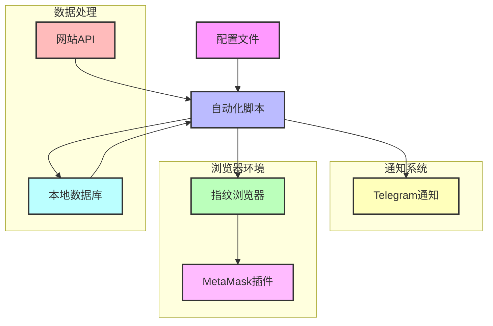
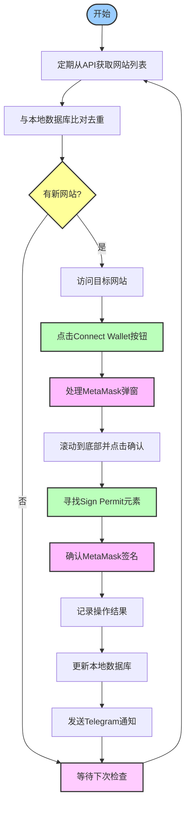
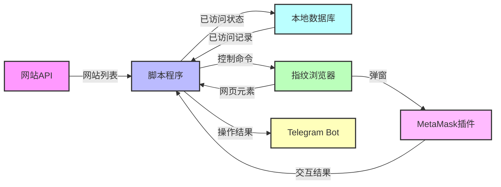

定制一个指纹浏览器 Selenium/DrissionPage工具 实现拉取远端的网页, 使用MetaMask模拟登录, Sign Permit操作

## 项目概述
本项目旨在开发一个自动化工具，可以通过指纹浏览器模拟用户访问特定网站，并执行MetaMask钱包连接和签名操作，实现24小时无人值守的自动化操作。

## 环境准备
- 指纹浏览器已提前创建好，不需要程序拉起，程序只需控制现有浏览器实例
- MetaMask插件已提前安装并配置好账户
- 必须支持MetaMask官方最新版本，不允许使用修改版
- 所有环境配置文件将提前准备好，程序只需读取配置进行操作

## 功能需求

### 基础功能
1. 通过API获取待访问的网站列表
2. 自动访问网站并模拟用户操作
3. 自动连接MetaMask钱包
4. 自动执行Sign Permit签名操作
5. 操作完成后发送通知到Telegram Bot
6. 本地存储已访问网站信息并进行去重处理

### 配置参数
配置文件需包含以下内容:
- 获取要访问的网站地址API
- 获取列表间隔: 60秒
- ConnectWallet的buttonClass 或 ConnectWallet的buttonId
- Sign Permit的buttonClass 或 Sign Permit的buttonId
- 每个网站操作次数: 2
- Telegram Bot API Token与Chat ID
- 已访问网站本地存储路径

### 数据存储与处理
- 本地必须维护已访问网站的数据库或文件记录
- API返回的网站列表格式为文本格式，一行一个网址
- 每次从API拉取新网站后，需与本地记录比对去重，只处理未访问过的网站
- 每个网站的访问状态、访问次数和最后访问时间需记录在本地
- 定期清理过期数据，优化存储空间

## 操作流程
基于step文件夹中的截图，操作流程如下：

1. **获取并处理网站列表**
   - 从配置的API获取网站列表（一行一个网址）
   - 与本地已访问记录比对，筛选出未访问或需要重复访问的网站
   - 按优先级排序待访问网站列表

2. **打开网站并连接钱包**
   - 访问目标网站
   - 定位并点击"Connect Wallet"按钮（参考截图：连接钱包.png）
   - 系统弹出连接钱包选项（参考截图：弹出连接钱包.png）

3. **MetaMask授权流程**
   - 弹出MetaMask插件窗口
   - 在MetaMask窗口中滚动到底部查看详情（参考截图：弹出小狐狸插件-拉到下面点确定.png）
   - 点击"确定"按钮进行连接授权（参考截图：点击小狐狸插件的最终确定.png）

4. **执行签名操作**
   - 在网站上定位并点击触发签名的元素（参考截图：找到Sign Permit.png）
   - 在MetaMask弹窗中确认签名操作
   - 完成操作并等待结果（参考截图：完成.png）

5. **操作完成后**
   - 更新本地数据记录，标记网站为已访问状态
   - 记录操作结果和访问时间
   - 发送通知到配置的Telegram Bot
   - 按照设定的间隔等待下一次任务

## 技术要求
1. 使用Selenium/DrissionPage作为底层自动化工具
2. 要求在指纹浏览器环境下稳定运行
3. 支持24小时无人值守运行
4. 具备错误处理和重试机制
5. 日志记录详细的操作步骤和错误信息
6. 当有新增网站操作需求时，能够灵活控制现有浏览器进行相应操作
7. 高效的本地数据存储和检索机制，确保快速去重和状态更新

## 测试与验证
测试网站: https://metamask.github.io/test-dapp/
- 用于验证连接钱包和Sign Permit功能是否正常

## 预算与扩展
- 基础功能开发预算: 1500r
- 每增加一种新的钱包操作类型: 500r
- 预计操作类型总数: 10个以下

## 长期合作
需要寻找能够提供长期技术支持的合作伙伴，以应对网站结构变化和新需求的增加。

例子网站 用于触发连接钱包和Sign Permit 与实际访问网站类似: 
https://metamask.github.io/test-dapp/

## 项目流程图与架构

### 系统架构图

### 操作流程图

### 数据流图

